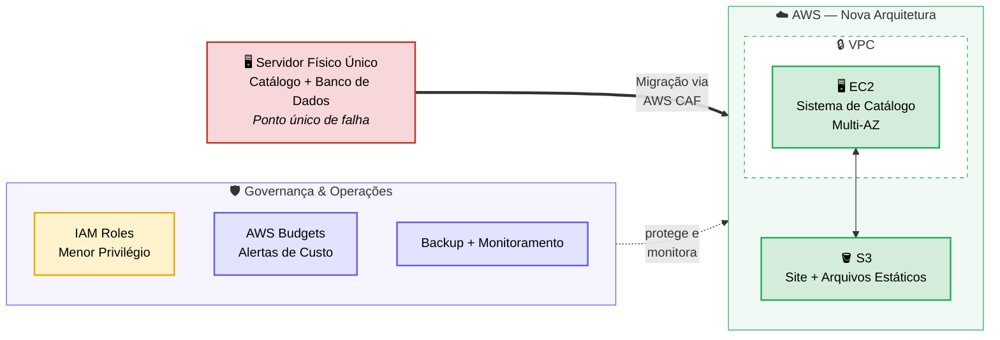

# Missão 3 — Plano de Migração para a AWS (CAF + Well-Architected Framework)

## O problema de negócio

Com o site institucional já hospedado no S3 (Missão 1) e o acesso à infraestrutura já organizado via IAM (Missão 2), resta o núcleo mais crítico da operação da Sabor Caseiro: o servidor físico que ainda hospeda o sistema de catálogo de produtos e o banco de dados de clientes. Esse servidor está gerando dois problemas recorrentes para a empresa: custo alto e crescente de manutenção de hardware, e risco real de indisponibilidade, já que não existe nenhuma redundância — se ele falhar, a operação de vendas para completamente.

A liderança da Sabor Caseiro pediu um plano estruturado — não apenas técnico, mas estratégico — para migrar essa operação restante para a AWS. Este é o papel de um Consultor Cloud: não só *executar* a migração, mas *planejar* e *justificar* cada decisão perante quem vai aprovar o investimento.

## Por que usar o AWS CAF (e não migrar "no improviso")

O AWS Cloud Adoption Framework organiza a migração em perspectivas que vão além da parte puramente técnica — incluindo negócio, pessoas, governança, plataforma, segurança e operações. Usei o CAF neste projeto para garantir que o plano da Sabor Caseiro não fosse só "mover o servidor para a nuvem", mas considerasse também quem seria impactado na equipe, como a governança de custos seria mantida, e como a segurança seria tratada desde o início — e não como um ajuste posterior, que é exatamente o tipo de decisão no improviso que costuma gerar os custos absurdos e falhas de segurança comuns em migrações mal planejadas.

## O Plano de Migração (usando as perspectivas do CAF)

| Perspectiva CAF | Ação planejada no projeto |
|---|---|
| **Negócio** | Apresentação à liderança de uma estimativa comparando o custo fixo atual de manutenção do servidor físico (hardware, energia, espaço no data center local) com o custo variável projetado na AWS, demonstrando redução esperada de custo operacional. |
| **Pessoas** | Levantamento da necessidade de capacitação da equipe de TI (as mesmas duas pessoas da Missão 2) em conceitos de AWS antes da migração completa, evitando que o conhecimento fique concentrado em apenas uma pessoa. |
| **Governança** | Definição de tags de alocação de custo (cost allocation tags) por projeto e centro de custo, além de um orçamento configurado via AWS Budgets, com alertas automáticos para evitar os gastos descontrolados que a empresa quer evitar desde o início. |
| **Plataforma** | Escolha da arquitetura AWS que substituirá o servidor físico: uma instância EC2 para o sistema de catálogo, com armazenamento de arquivos estáticos em S3 — reaproveitando a mesma lógica já validada na Missão 1. |
| **Segurança** | Aplicação do modelo de responsabilidade compartilhada da AWS e reaproveitamento da estrutura de controle de acesso via IAM já construída na Missão 2, garantindo que o novo ambiente nasça seguindo o Princípio do Menor Privilégio, e não como um ajuste posterior. |
| **Operações** | Definição de uma rotina de backup automatizado e monitoramento contínuo pós-migração, algo que hoje não existe no servidor físico da Sabor Caseiro. |

## Diagrama da Arquitetura

O diagrama representa a transição do servidor físico único da Sabor Caseiro, sem redundância, para uma arquitetura com uma instância EC2 dentro de uma VPC, o bucket S3 já existente da Missão 1 para armazenamento de objetos, e as Roles IAM da Missão 2 controlando o acesso entre os serviços — eliminando o ponto único de falha que existe hoje na operação da empresa.

## Justificativa via Well-Architected Framework

O guia pede a justificativa de pelo menos três pilares. Aqui está a análise aplicada ao cenário da Sabor Caseiro:

### 1. Segurança

A arquitetura proposta aplica o Princípio do Menor Privilégio, já demonstrado e testado na Missão 2, diferente do servidor on-premise original da Sabor Caseiro, onde o acesso administrativo era compartilhado entre a equipe sem controle granular nem rastreabilidade de quem fez o quê.

### 2. Confiabilidade

O servidor físico on-premise da Sabor Caseiro representa hoje um ponto único de falha — se ele cair, a operação de vendas online para completamente, sem nenhum plano de contingência. Na AWS, a arquitetura proposta pode usar múltiplas zonas de disponibilidade (Multi-AZ), reduzindo drasticamente o risco de indisponibilidade que a empresa enfrenta atualmente.

### 3. Otimização de Custos

O modelo on-premise atual exige investimento fixo em hardware, independentemente do uso real — a Sabor Caseiro paga o mesmo custo de manutenção do servidor tanto em períodos de pico de vendas quanto em períodos de baixa movimentação. Na AWS, o modelo pay-as-you-go permite dimensionar os recursos conforme a demanda real, evitando pagar por capacidade ociosa fora dos períodos de maior movimento.

### 4. Excelência Operacional

Hoje, qualquer ajuste no servidor físico da Sabor Caseiro depende de intervenção manual local por uma das duas pessoas da equipe de TI. A arquitetura proposta na AWS abre caminho para automação de rotinas operacionais (como backups e monitoramento, já mencionados na perspectiva de Operações do CAF), reduzindo a dependência de intervenção manual repetitiva.

## Dificuldades encontradas

- A parte mais difícil não foi desenhar o diagrama em si, mas decidir o nível de detalhe certo — meu primeiro rascunho tinha componentes técnicos demais (sub-redes, tabelas de rotas detalhadas) e ficou confuso até para mim mesmo reler depois, então simplifiquei para focar nos componentes que efetivamente sustentam a narrativa da migração.
- Tive dificuldade em separar claramente algumas perspectivas do CAF sem repetir a mesma ideia em categorias diferentes — por exemplo, a decisão de reaproveitar as Roles IAM da Missão 2 parecia se encaixar tanto em "Segurança" quanto em "Plataforma" ao mesmo tempo, e precisei decidir em qual perspectiva ela fazia mais sentido para não duplicar a justificativa.
- Justificar a perspectiva de "Negócio" foi mais desafiador do que as perspectivas técnicas, porque exigiu pensar em números e custo-benefício de um jeito que minha formação técnica não tinha me preparado tão diretamente — foi um exercício de tradução do técnico para a linguagem que a liderança da empresa entende.

## Evidências

## Próximos passos (se este projeto fosse para produção real)

O próximo passo lógico seria propor à liderança da Sabor Caseiro um piloto de migração — migrar primeiro um serviço não-crítico, como um ambiente de testes do catálogo, antes de migrar o banco de dados de clientes, que é o componente mais sensível. Isso permitiria validar métricas reais de custo e performance na prática, antes de comprometer a operação principal da empresa em uma migração completa de uma só vez.
